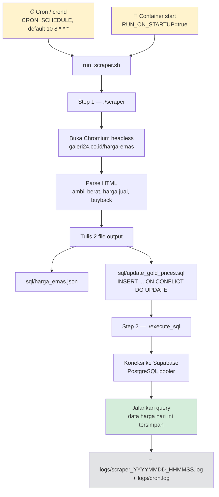

# 🏅 Gold Price Scraper & Automation

Scraper otomatis untuk mengambil harga emas dari [Galeri24.co.id](https://galeri24.co.id/harga-emas) dan menyimpannya ke Supabase PostgreSQL setiap hari.

## ✨ Fitur

- 🤖 Scraping otomatis dengan headless browser (ChromeDP)
- 📊 Mendukung 3 brand: Galeri24, Antam, UBS (0.5–100 gram)
- 💾 Simpan otomatis ke Supabase PostgreSQL (pola upsert: INSERT jika belum ada, UPDATE jika sudah)
- ⏰ Jadwal cron yang bisa diatur lewat environment variable
- 🐳 Siap deploy di Docker, Dokploy, dan Render
- 📝 Logging otomatis + pembersihan log lama

## 🔄 Cara Kerja

### Diagram Alur


```mermaid
flowchart TD
    A["⏰ Cron / crond<br/>CRON_SCHEDULE, default 10 8 * * *"] --> B["run_scraper.sh"]
    S["🚀 Container start<br/>RUN_ON_STARTUP=true"] --> B

    B --> C["Step 1 — ./scraper"]
    C --> D["Buka Chromium headless<br/>galeri24.co.id/harga-emas"]
    D --> E["Parse HTML<br/>ambil berat, harga jual, buyback"]
    E --> G["Tulis 2 file output"]

    G --> H["sql/harga_emas.json"]
    G --> I["sql/update_gold_prices.sql<br/>INSERT ... ON CONFLICT DO UPDATE"]

    I --> J["Step 2 — ./execute_sql"]
    J --> K["Koneksi ke Supabase<br/>PostgreSQL pooler"]
    K --> L["Jalankan query<br/>data harga hari ini tersimpan"]

    L --> M["📝 logs/scraper_YYYYMMDD_HHMMSS.log<br/>+ logs/cron.log"]

    style A fill:#fff3cd
    style S fill:#fff3cd
    style L fill:#d4edda
    style M fill:#e2e3e5
```

### Penjelasan Tiap Tahap

**1. Pemicu (trigger)**

Ada dua jalur yang memanggil `run_scraper.sh`:

- **Saat container start** — kalau `RUN_ON_STARTUP=true`, scraper langsung jalan sekali tanpa menunggu jadwal.
- **Cron harian** — `crond` menjalankan sesuai `CRON_SCHEDULE` (default `10 8 * * *`, jam 08:10 WIB).

`docker-entrypoint.sh` yang menyiapkan semuanya: menulis `.env` dari environment variable, memvalidasi format `CRON_SCHEDULE` (harus 5 field), lalu menyusun crontab.

**2. Scraper (`scrapper/scrapper.go` → binary `./scraper`)**

- Menjalankan Chromium headless lewat ChromeDP ke halaman harga Galeri24.
- Parsing tabel HTML untuk tiap brand (Galeri24, Antam, UBS) → berat, harga jual, harga buyback.
- Menghasilkan dua file di folder `sql/`:
  - `harga_emas.json` — data mentah hasil scraping.
  - `update_gold_prices.sql` — query siap eksekusi.

**3. Pola upsert di SQL yang dihasilkan**

Satu query per baris harga:

```sql
INSERT INTO public.gold_prices_v2 ("date", brand, denom, price_buyback, price_sell)
VALUES ('2026-09-19', 'Galeri24', 0.5, 1220000.0, 1356000)
ON CONFLICT ("date", brand, denom) DO UPDATE
SET price_buyback=EXCLUDED.price_buyback, price_sell=EXCLUDED.price_sell;
```

Kolom `id` sengaja tidak diisi — kolom itu `GENERATED BY DEFAULT AS IDENTITY`, jadi PostgreSQL yang menentukan nilainya dan tidak pernah ada bentrok primary key. Constraint `UNIQUE(date, brand, denom)` yang memutuskan: tanggal+brand+denom belum ada → baris baru; sudah ada → harganya ditimpa.

Efeknya: dijalankan sekali atau sepuluh kali di hari yang sama hasilnya tetap sama (idempoten), tidak ada baris duplikat.

> ⚠️ **Wajib:** `ON CONFLICT` butuh constraint unik pada kolom yang disebut. Tabel lama mungkin cuma punya index biasa (non-unique), dan querynya akan gagal dengan `there is no unique or exclusion constraint matching the ON CONFLICT specification`. Cek dan pasang sekali saja:
>
> ```sql
> -- Pastikan belum ada duplikat (harus 0 baris)
> SELECT "date", brand, denom, COUNT(*)
> FROM public.gold_prices_v2
> GROUP BY 1,2,3 HAVING COUNT(*) > 1;
>
> -- Baru pasang constraint-nya
> ALTER TABLE public.gold_prices_v2
> ADD CONSTRAINT gold_prices_v2_date_brand_denom_key UNIQUE ("date", brand, denom);
> ```

**4. Executor (`scheduler/execute_sql.go` → binary `./execute_sql`)**

Membaca `sql/update_gold_prices.sql`, konek ke Supabase lewat connection pooler, lalu mengeksekusi semua query.

**5. Logging**

Tiap run menulis ke `logs/scraper_YYYYMMDD_HHMMSS.log`, dan output cron masuk ke `logs/cron.log`. Log lebih dari 30 hari dibersihkan otomatis.

## 🚀 Mulai Cepat

### Prasyarat

- Go 1.24+
- Chromium/Chrome
- Akun Supabase

### Setup Lokal

```bash
git clone https://github.com/igmerwina/gold-price-scrapper.git
cd gold-scrapper

# Siapkan environment
cp scheduler/.env.example scheduler/.env
nano scheduler/.env  # Isi kredensial Supabase
```

**Setup database:**
```sql
CREATE TABLE public.gold_prices_v2 (
    id INTEGER GENERATED BY DEFAULT AS IDENTITY PRIMARY KEY,
    date DATE NOT NULL,
    brand VARCHAR(50) NOT NULL,
    denom DECIMAL(10,2) NOT NULL,
    price_sell DECIMAL(15,2),
    price_buyback DECIMAL(15,2),
    created_at TIMESTAMP DEFAULT NOW(),
    updated_at TIMESTAMP DEFAULT NOW(),
    -- Wajib: ON CONFLICT bergantung pada constraint ini
    CONSTRAINT gold_prices_v2_date_brand_denom_key UNIQUE (date, brand, denom)
);
```

**Environment variable:**
```env
SUPABASE_HOST=aws-1-ap-southeast-1.pooler.supabase.com
SUPABASE_PORT=6543
SUPABASE_USER=postgres.your-project-ref
SUPABASE_PASSWORD=your-password
SUPABASE_DB=postgres
SUPABASE_SSL_MODE=require
TABLE_NAME=gold_prices_v2
CRON_SCHEDULE="10 8 * * *"
```

### Jalankan Manual

```bash
# Tes scraper saja
cd scrapper
go run scrapper.go

# Jalankan alur penuh (scrape + update DB)
cd scheduler
bash run_scraper.sh
```

## 🚢 Deployment

Ada dua pendekatan berbeda, pilih salah satu:

| | GitHub Actions (disarankan) | Docker / Dokploy / Render |
|---|---|---|
| Model | Runner nyala ~2 menit saat jadwal, lalu mati | Container nyala 24/7, cron di dalamnya |
| Perlu server? | Tidak | Ya |
| Biaya | Gratis | Gratis–$7/bln tergantung platform |
| Cocok untuk | Jadwal harian seperti proyek ini | Kalau butuh kontrol penuh / self-host |

### GitHub Actions

Karena aplikasi ini sebenarnya cuma cron job, tidak perlu server yang menyala terus. Workflow `.github/workflows/scrape.yml` menjalankan seluruh alur di runner GitHub setiap jam 08:10 WIB (`10 1 * * *` UTC).

**Setup:**

1. Repo → Settings → Secrets and variables → Actions → New repository secret
2. Tambahkan secret berikut:

   | Secret | Contoh |
   |---|---|
   | `SUPABASE_HOST` | `aws-1-ap-southeast-1.pooler.supabase.com` |
   | `SUPABASE_PORT` | `6543` |
   | `SUPABASE_USER` | `postgres.your-project-ref` |
   | `SUPABASE_PASSWORD` | `your-password` |
   | `SUPABASE_DB` | `postgres` |

3. Tab **Actions** → **Scrape Gold Prices** → **Run workflow** untuk uji coba manual.

File `sql/harga_emas.json` dan `sql/update_gold_prices.sql` hasil tiap run diunggah sebagai artifact (disimpan 7 hari) untuk memudahkan debugging.

> ⚠️ **Catatan:** GitHub menonaktifkan scheduled workflow otomatis kalau repo tidak ada aktivitas selama 60 hari. Cukup jalankan workflow manual atau push commit untuk mengaktifkannya lagi. Jadwal juga bisa telat 5–15 menit saat runner GitHub sedang ramai.

### Docker Compose

```bash
cp scheduler/.env.example .env
nano .env  # Isi kredensial

docker-compose up -d      # Jalankan
docker-compose logs -f    # Lihat log
docker-compose down       # Hentikan
```

### Dokploy

1. Dokploy → Create Application
2. Pilih tipe "Docker"
3. Isi environment variable (SUPABASE_HOST, SUPABASE_PASSWORD, dll)
4. Deploy dari GitHub/Docker Hub

### Render

Render **Web Service** mewajibkan ada port yang terbuka di `0.0.0.0`, padahal aplikasi ini murni cron worker tanpa HTTP server. Tanpa penanganan, deploy akan gagal dengan:

```
==> No open ports detected on 0.0.0.0, continuing to scan...
==> Port scan timeout reached... Timed Out
```

Solusi yang dipakai: `docker-entrypoint.sh` menjalankan HTTP listener kecil (`busybox httpd`) di `$PORT` sebagai latar belakang, hanya supaya port scan Render lolos. Cron tetap berjalan seperti biasa di belakangnya.

> ⚠️ **Free tier Render tidak cocok untuk cron.** Web Service gratis di-*spin down* setelah ~15 menit tanpa traffic HTTP masuk — container mati, `crond` ikut mati, dan jadwal harian tidak pernah jalan. Dummy listener hanya membuat deploy lolos, bukan membuat container tetap hidup. Supaya cron benar-benar jalan: pakai **GitHub Actions** (gratis), atau naik ke plan **Starter** yang tidak spin down. Opsi **Background Worker** lebih tepat secara arsitektur tapi tidak tersedia di free tier.

Langkah deploy:
1. Render → New → Web Service → hubungkan repo ini
2. Runtime: Docker (otomatis membaca `Dockerfile`)
3. Isi semua environment variable Supabase + `CRON_SCHEDULE`
4. Deploy — port `$PORT` diisi otomatis oleh Render, tidak perlu diset manual

## 📋 Konfigurasi

### Ubah Jadwal Cron

Edit `.env`:
```env
CRON_SCHEDULE="10 8 * * *"      # Setiap hari jam 08:10
CRON_SCHEDULE="0 */4 * * *"     # Setiap 4 jam
CRON_SCHEDULE="30 9,15 * * *"   # Jam 09:30 dan 15:30
CRON_SCHEDULE="0 8 * * 1-5"     # Senin–Jumat jam 08:00
```

Format wajib 5 field, kalau salah container akan berhenti dengan pesan error yang jelas.

### Ubah Nama Tabel

```env
TABLE_NAME=gold_prices_v2       # Produksi
TABLE_NAME=gold_prices_staging  # Staging
TABLE_NAME=gold_prices_test     # Testing
```

### Opsi Environment Lain

| Variable | Default | Fungsi |
|---|---|---|
| `TZ` | `Asia/Jakarta` | Zona waktu container, memengaruhi jam cron |
| `RUN_ON_STARTUP` | `true` | Jalankan scraper sekali saat container start |
| `USE_LOOP_SCHEDULER` | `false` | Pakai `loop-scheduler.sh` sebagai ganti `crond` (untuk host yang bermasalah dengan `setpgid`) |
| `PORT` | `10000` | Port dummy HTTP listener (diisi otomatis oleh Render) |

## 📁 Struktur Proyek

```
gold-scrapper/
├── .github/workflows/
│   └── scrape.yml             # Jadwal harian via GitHub Actions
├── scrapper/
│   └── scrapper.go            # Logika scraping + generate SQL
├── scheduler/
│   └── execute_sql.go         # Eksekusi SQL ke Supabase
├── sql/                       # File hasil scraping
│   ├── harga_emas.json
│   └── update_gold_prices.sql
├── logs/                      # Log tiap run
├── Dockerfile                 # Build multi-stage
├── docker-compose.yml         # Setup Docker lokal
├── docker-entrypoint.sh       # Startup: .env, crontab, dummy HTTP listener
├── run_scraper_docker.sh      # Runner utama (scrape → update DB)
├── loop-scheduler.sh          # Scheduler alternatif tanpa cron
└── test_cron.sh               # Cek cron benar-benar jalan
```

## 🐛 Troubleshooting

**Container tidak jalan?**
```bash
docker-compose logs -f
docker exec -it gold-scraper sh
```

**File SQL tidak dihasilkan?**
```bash
docker exec -it gold-scraper ls -la /app/sql/
docker exec -it gold-scraper ./scraper    # Jalankan manual
```

**Koneksi database gagal?**
```bash
docker exec -it gold-scraper env | grep SUPABASE
docker exec -it gold-scraper ./execute_sql
```

**Cron tidak jalan?**
```bash
docker exec -it gold-scraper crontab -l
docker exec -it gold-scraper tail -f /app/logs/cron.log
```

Kalau muncul error `setpgid` dari `crond`, set `USE_LOOP_SCHEDULER=true` untuk memakai scheduler berbasis loop.

**Deploy Render timeout "No open ports detected"?**

Pastikan `busybox-extras` terpasang di `Dockerfile` (applet `httpd` tidak ikut di busybox bawaan Alpine) dan `docker-entrypoint.sh` menjalankan listener di `0.0.0.0:$PORT`.

## 📊 File Output

**JSON** (`sql/harga_emas.json`):
```json
[
  {
    "brand": "GALERI 24",
    "data": [
      {
        "berat": "0.5",
        "harga_jual": "892500",
        "harga_buyback": "842500"
      }
    ]
  }
]
```

**SQL** (`sql/update_gold_prices.sql`) — lihat contoh pola upsert di bagian [Cara Kerja](#-cara-kerja). Satu file berisi 24 query upsert (8 denominasi × 3 brand).

## 📈 Performa

- Scraping: ~10–12 detik
- Eksekusi SQL: ~1–2 detik
- Total: ~15 detik per run

## 🔐 Keamanan

- Jangan pernah commit file `.env`
- Pakai connection pooler (port 6543)
- Aktifkan SSL: `SUPABASE_SSL_MODE=require`

## 📄 Lisensi

MIT License

## 👨‍💻 Author

[@igmerwina](https://github.com/igmerwina)

---

⭐ Star kalau membantu!
